# GameStore Kubernetes Component Diagram

## System Architecture - All Components & Relationships

```mermaid
graph TB
    subgraph External["External Layer"]
        Browser["🌐 Web Browser<br/>Client Requests"]
        Internet["Internet"]
    end

    subgraph Ingress["Ingress & Load Balancing"]
        IGCtrl["Ingress Controller<br/>(nginx-ingress)<br/>Path Routing"]
        IGService["Ingress Service<br/>(LoadBalancer)"]
    end

    subgraph APIGateway["API Gateway Layer"]
        Nginx["🔄 Nginx Pod (Deployment)<br/>main: nginx:latest<br/>requests: 100m CPU, 64Mi mem<br/>limits: 500m CPU, 256Mi mem<br/>⭐ Replicas: Dev=1, Stage=3, Prod=4"]
        NGSvc["Service: api-gateway<br/>Port 80→80<br/>ClusterIP"]
    end

    subgraph Services["Microservices (Deployments)"]
        AuthDep["Auth Service Pod<br/>Deployment: auth-service<br/>Image: gamestore-auth-service<br/>Port: 3001<br/>requests: 100m CPU, 128Mi mem<br/>⭐ Dev=1 replica, Stage=2, Prod=4"]
        AuthSvc["Service: auth-service<br/>Port 3001<br/>ClusterIP"]

        GameDep["Game Service Pod<br/>Deployment: game-service<br/>Image: gamestore-game-service<br/>Port: 3002<br/>requests: 150m CPU, 256Mi mem<br/>⭐ Dev=1 replica, Stage=2, Prod=4"]
        GameSvc["Service: game-service<br/>Port 3002<br/>ClusterIP"]

        OrdersDep["Orders Service Pod<br/>Deployment: orders-service<br/>Image: gamestore-orders-service<br/>Port: 3003<br/>requests: 150m CPU, 256Mi mem<br/>⭐ Dev=1 replica, Stage=2, Prod=4"]
        OrdersSvc["Service: orders-service<br/>Port 3003<br/>ClusterIP"]

        ReviewsDep["Reviews Service Pod<br/>Deployment: reviews-service<br/>Image: gamestore-reviews-service<br/>Port: 3004<br/>requests: 150m CPU, 256Mi mem<br/>⭐ Dev=1 replica, Stage=2, Prod=4"]
        ReviewsSvc["Service: reviews-service<br/>Port 3004<br/>ClusterIP"]

        FrontEnd["Frontend Pod (Deployment)<br/>Image: gamestore-frontend<br/>Port: 3000 (React)<br/>⭐ Dev=1, Stage=2, Prod=3"]
        FrontSvc["Service: frontend<br/>Port 3000<br/>ClusterIP"]
    end

    subgraph Data["Data Storage Layer"]
        PostgreSQL["PostgreSQL (StatefulSet)<br/>StatefulSet: postgres<br/>Image: postgres:15<br/>Port: 5432<br/>requests: 250m CPU, 512Mi mem<br/>limits: 1000m CPU, 1Gi mem<br/>⭐ Replicas: Dev=1, Staging=1, Prod=2"]
        PGSvc["Headless Service: postgres<br/>Port 5432<br/>DNS: postgres.gamestore.svc.cluster.local"]
        PGVolume["PersistentVolume<br/>PVC: postgres-pvc<br/>Size: Dev=10Gi, Stage=20Gi, Prod=100Gi<br/>StorageClass: standard"]

        Redis["Redis Pod (Deployment)<br/>Image: redis:7<br/>Port: 6379<br/>requests: 50m CPU, 128Mi mem<br/>⭐ Replicas: Dev=1, Stage=1, Prod=2"]
        RedisSvc["Service: redis<br/>Port 6379<br/>ClusterIP"]
        RedisVolume["PersistentVolume<br/>PVC: redis-pvc<br/>Size: Dev=5Gi, Stage=10Gi, Prod=20Gi"]
    end

    subgraph Search["Full-Text Search"]
        Solr["Apache Solr Pod (Deployment)<br/>Image: solr:9<br/>Port: 8983<br/>Java Heap: 512Mi<br/>requests: 200m CPU, 512Mi mem<br/>⭐ Replicas: Dev=1, Stage=1, Prod=2"]
        SolrSvc["Service: solr<br/>Port 8983<br/>ClusterIP"]
        SolrVolume["PersistentVolume<br/>PVC: solr-pvc<br/>Size: Dev=10Gi, Stage=20Gi, Prod=50Gi"]
    end

    subgraph Monitoring["Monitoring & Observability"]
        Prometheus["Prometheus Pod (StatefulSet)<br/>StatefulSet: prometheus<br/>Image: prometheus:latest<br/>Port: 9090<br/>requests: 200m CPU, 256Mi mem<br/>⭐ Replicas: 1<br/>Retention: Dev=7d, Stage=14d, Prod=90d"]
        PromSvc["Service: prometheus<br/>Port 9090<br/>ClusterIP"]
        PromVolume["PersistentVolume<br/>PVC: prometheus-pvc<br/>Size: Dev=10Gi, Stage=20Gi, Prod=100Gi"]

        Grafana["Grafana Pod (Deployment)<br/>Image: grafana/grafana<br/>Port: 3005<br/>requests: 100m CPU, 128Mi mem<br/>⭐ Replicas: 1"]
        GrafanaSvc["Service: grafana<br/>Port 3005<br/>ClusterIP"]
        GrafanaVolume["PersistentVolume<br/>PVC: grafana-pvc<br/>Size: 2Gi"]
    end

    subgraph ConfigSecrets["Configuration & Secrets"]
        ConfigMap["ConfigMap: gamestore-config<br/>Contains: NODE_ENV, DB_HOST,<br/>LOG_LEVEL, API_KEYS"]
        Secrets["Secret: gamestore-secrets<br/>Encrypted: JWT_SECRET,<br/>DB_USER, DB_PASSWORD"]
    end

    subgraph Autoscaling["Auto-Scaling"]
        HPA["HorizontalPodAutoscaler<br/>HPA for: auth, game, orders, reviews<br/>Min Replicas: Dev=N/A, Stage=1, Prod=2<br/>Max Replicas: Dev=N/A, Stage=3, Prod=10<br/>Target CPU: 50%<br/>Target Memory: 70%<br/>⭐ Dev=disabled, Stage/Prod=enabled"]
        VPA["VerticalPodAutoscaler (Optional)<br/>Recommends CPU/Memory limits<br/>⭐ Dev=disabled, Prod=enabled"]
    end

    subgraph Namespace["Kubernetes Namespace"]
        NSResource["Namespace: gamestore-[dev|staging|prod]<br/>ResourceQuota"]
        RQ["ResourceQuota:<br/>Dev: 4 CPU, 8Gi mem<br/>Stage: 8 CPU, 16Gi mem<br/>Prod: Unlimited"]
    end

    %% External Traffic Flow
    Browser -->|HTTP/HTTPS| Internet
    Internet -->|Traffic| IGCtrl
    IGCtrl -->|Routes| IGService

    %% Ingress to API Gateway
    IGService -->|Port 80| NGSvc
    NGSvc --> Nginx

    %% API Gateway to Services
    Nginx -->|Route /api/auth| AuthSvc
    Nginx -->|Route /api/games| GameSvc
    Nginx -->|Route /api/orders| OrdersSvc
    Nginx -->|Route /api/reviews| ReviewsSvc
    Nginx -->|Route /| FrontSvc

    %% Services to their Pods
    AuthSvc --> AuthDep
    GameSvc --> GameDep
    OrdersSvc --> OrdersDep
    ReviewsSvc --> ReviewsDep
    FrontSvc --> FrontEnd

    %% Services to Data Layer
    AuthDep -->|TCP:5432| PGSvc
    GameDep -->|TCP:5432| PGSvc
    OrdersDep -->|TCP:5432| PGSvc
    ReviewsDep -->|TCP:5432| PGSvc

    AuthDep -->|TCP:6379| RedisSvc
    GameDep -->|TCP:6379| RedisSvc
    OrdersDep -->|TCP:6379| RedisSvc
    ReviewsDep -->|TCP:6379| RedisSvc

    GameDep -->|TCP:8983| SolrSvc

    %% Data Layer
    PGSvc --> PostgreSQL
    PostgreSQL -->|Mounts| PGVolume

    RedisSvc --> Redis
    Redis -->|Mounts| RedisVolume

    SolrSvc --> Solr
    Solr -->|Mounts| SolrVolume

    %% Monitoring
    Prometheus -->|Scrapes| AuthDep
    Prometheus -->|Scrapes| GameDep
    Prometheus -->|Scrapes| OrdersDep
    Prometheus -->|Scrapes| ReviewsDep
    Prometheus -->|Scrapes| Nginx

    PromSvc --> Prometheus
    Prometheus -->|Mounts| PromVolume

    Grafana -->|Queries| PromSvc
    GrafanaSvc --> Grafana
    Grafana -->|Mounts| GrafanaVolume

    %% Configuration
    ConfigMap -->|env vars| AuthDep
    ConfigMap -->|env vars| GameDep
    ConfigMap -->|env vars| OrdersDep
    ConfigMap -->|env vars| ReviewsDep
    ConfigMap -->|env vars| FrontEnd

    Secrets -->|Secret env| AuthDep
    Secrets -->|Secret env| GameDep
    Secrets -->|Secret env| OrdersDep
    Secrets -->|Secret env| ReviewsDep

    %% Autoscaling
    HPA -->|Monitors & Scales| AuthDep
    HPA -->|Monitors & Scales| GameDep
    HPA -->|Monitors & Scales| OrdersDep
    HPA -->|Monitors & Scales| ReviewsDep

    VPA -->|Recommends| AuthDep
    VPA -->|Recommends| GameDep

    %% Namespace & Quotas
    NSResource -->|Enforces| AuthDep
    NSResource -->|Enforces| GameDep
    NSResource -->|Enforces| OrdersDep
    NSResource -->|Enforces| ReviewsDep
    NSResource -->|Enforces| Nginx
    NSResource -->|Enforces| PostgreSQL
    NSResource -->|Enforces| Prometheus

    RQ -->|Limits Resources| NSResource

    style External fill:#e1f5ff
    style Ingress fill:#fff3e0
    style APIGateway fill:#f3e5f5
    style Services fill:#e8f5e9
    style Data fill:#fce4ec
    style Search fill:#fff9c4
    style Monitoring fill:#f0f4c3
    style ConfigSecrets fill:#ede7f6
    style Autoscaling fill:#e0f2f1
    style Namespace fill:#f1f8e9
```



## Component Legend

### Kubernetes Resources

| Symbol                          | Resource Type                                   | Purpose                                                          |
| ------------------------------- | ----------------------------------------------- | ---------------------------------------------------------------- |
| **Deployment**                  | Stateless application pods with rolling updates | Microservices, Frontend, Nginx, Redis, Solr, Prometheus, Grafana |
| **StatefulSet**                 | Ordered, persistent pod identity                | PostgreSQL, Prometheus (with PVC)                                |
| **Service**                     | Internal DNS and load balancing                 | Connectivity between pods and external access                    |
| **PersistentVolume (PV)**       | Storage abstraction                             | Database, cache, logs persistence                                |
| **PersistentVolumeClaim (PVC)** | Storage request                                 | Mounted by StatefulSet/Deployment                                |
| **ConfigMap**                   | Non-sensitive configuration                     | Database host, environment variables                             |
| **Secret**                      | Sensitive configuration                         | JWT secret, DB credentials (base64 encoded)                      |
| **HorizontalPodAutoscaler**     | Dynamic pod scaling                             | Auto-scale services based on CPU/Memory                          |
| **VerticalPodAutoscaler**       | Resource optimization recommendations           | Suggest CPU/Memory limits                                        |
| **Namespace**                   | Resource isolation boundary                     | gamestore-dev, gamestore-staging, gamestore-prod                 |
| **ResourceQuota**               | Namespace resource limits                       | Total CPU/Memory per environment                                 |
| **Ingress**                     | External traffic routing                        | Path-based routing to services                                   |

### Component Relationships

**Data Flow:**

1. Client request → Ingress → Nginx API Gateway → Service → Deployment Pods
2. Service pods access shared PostgreSQL for persistence
3. Services use Redis for caching frequently accessed data
4. Game Service indexes data in Solr for full-text search
5. Prometheus constantly scrapes metrics from service endpoints
6. Grafana queries Prometheus for dashboard visualization

**Configuration Flow:**

1. Secrets mounted as environment variables in pods
2. ConfigMap provides non-secret environment variables
3. Services discover each other via DNS (e.g., postgres.gamestore.svc.cluster.local)

**Scaling Flow:**

1. HPA monitors pod metrics every 15 seconds
2. If CPU/Memory > threshold → creates new pods
3. If CPU/Memory < threshold → terminates pods
4. Load balancer (Service) automatically includes new pods

---

## Multi-Environment Deployment (Kustomize)


---

## Request Flow Example: User Logging In


---

## Environment Resource Allocation

### Development (6GB Host RAM)

```
Host Machine: 6GB RAM

Docker/Kubernetes System: 1.5GB
├── Docker daemon: 300-500 MB
├── Kubernetes control plane: 300-400 MB
└── OS reserves: 700-800 MB

Container Workloads: ~3.5GB
├── PostgreSQL: 256 MB (requests) → 512 MB (actual)
├── Redis: 100 MB
├── Solr: 512 MB (Java heap)
├── Auth Service: 128 MB
├── Game Service: 256 MB
├── Orders Service: 256 MB
├── Reviews Service: 256 MB
├── Frontend: 100 MB
├── Nginx: 64 MB
├── Prometheus: 256 MB (reduced in dev)
└── Grafana: 200 MB (can skip)

TOTAL: ~2.5-3.5 GB (containers) + 1.5 GB (system) = 4-5 GB
BUFFER: 1-2 GB for spikes
```

### Production (16GB Host RAM, 3+ Nodes)

```
Node 1 (5GB):
├── Master Components
├── Auth Service (2 replicas)
└── Frontend (1 replica)

Node 2 (5GB):
├── Game Service (2 replicas)
├── Orders Service (2 replicas)
└── PostgreSQL (Primary)

Node 3 (5GB):
├── Reviews Service (2 replicas)
├── PostgreSQL (Replica)
├── Redis (Primary)
└── Monitoring

Node 4 (5GB):
├── Grid/Queue services
├── Redis (Replica)
└── Solr (2 replicas)

BENEFITS:
- Fault tolerance (lose 1 node, still operational)
- Load distribution
- Resource isolation
- Capacity for growth
```

---

## Summary

The GameStore Kubernetes architecture provides:

✅ **Scalability**: HPA automatically scales from 1-10+ replicas per service  
✅ **Reliability**: Multiple replicas, health checks, automated restarts  
✅ **Observability**: Prometheus metrics + Grafana dashboards  
✅ **Environment Isolation**: Separate namespaces with resource quotas  
✅ **Data Persistence**: StatefulSets for PostgreSQL, PVCs for all data  
✅ **Configuration Management**: ConfigMap + Secrets for app configuration  
✅ **Service Discovery**: DNS-based discovery via Kubernetes Services  
✅ **External Access**: Ingress controller for routing external traffic

**Key Resource Requirements:**

- Development: 6GB RAM minimum
- Staging: 12GB RAM minimum
- Production: 16GB+ RAM (distributed)
